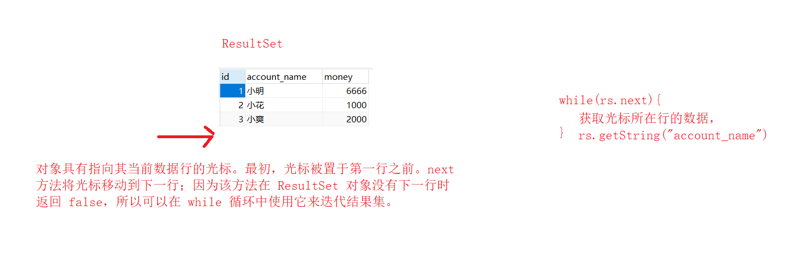
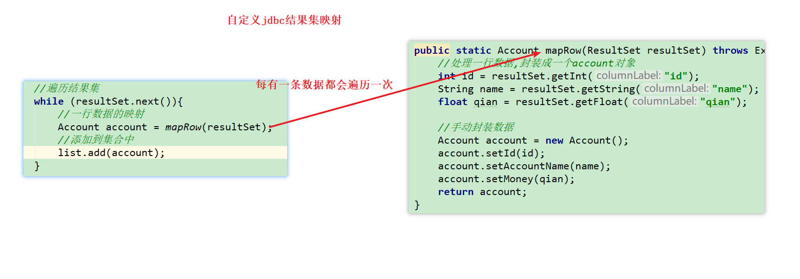
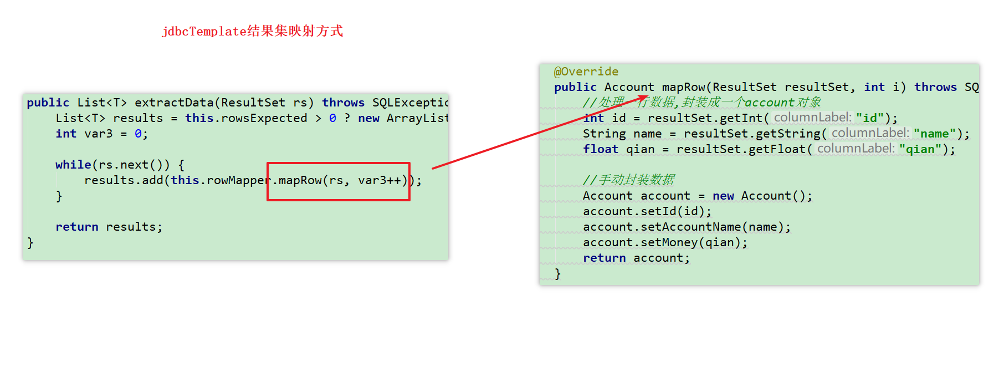
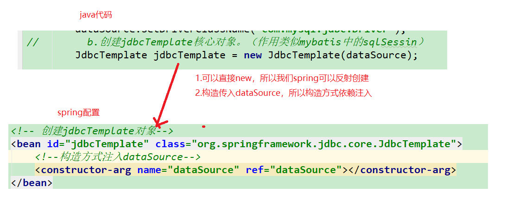
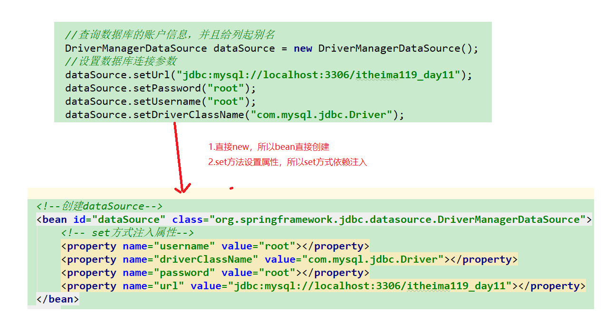
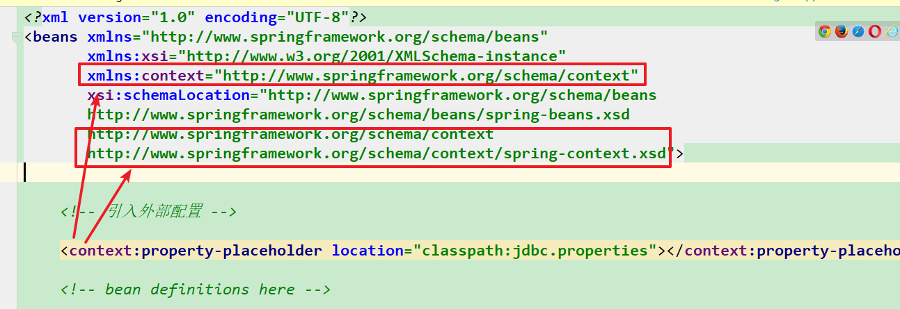
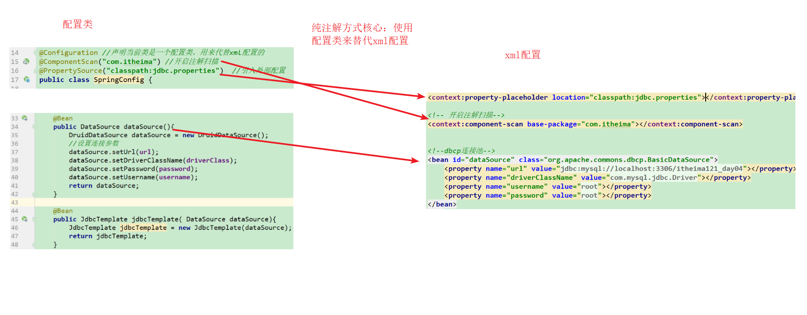
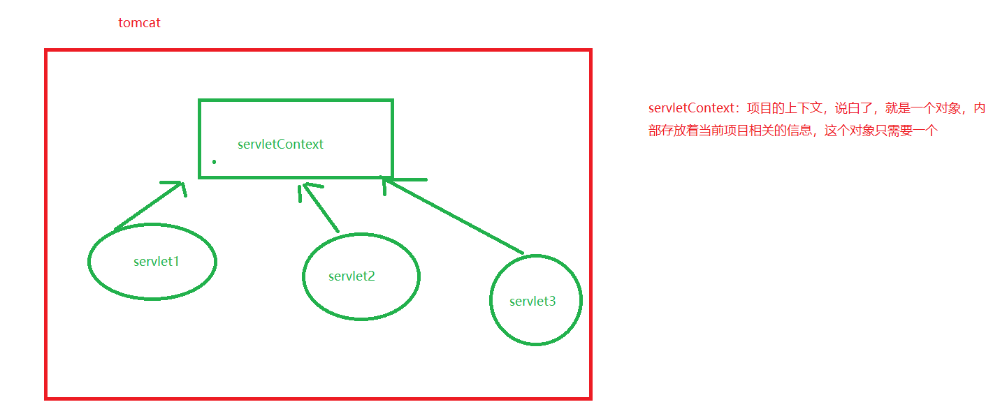

# 课堂笔记

# 1.jdbcTemplate （了解）

## 1.1 jdbcTemplate的介绍

~~~
这是spring提供的对于jdbc的封装，用于操作数据库的。相对mybatis，我们常用是mybatis。
~~~

## 1.2 jdbcTemplate快速入门

~~~
步骤：
1.引入依赖，spring-context,spring-jdbc,mysql驱动
2.准备数据库和实体
3.jdbcTemplate的api来操作数据库
	a.创建数据源（数据库连接池），使用spring自带的数据库连接池
	b.创建jdbcTemplate核心对象。（作用类似mybatis中的sqlSessin）
	c.通过jdbcTemplate直接操作数据库即可
~~~


1.引入依赖，spring-context,spring-jdbc,

```xml
<dependencies>
    <!-- spring的所有依赖需要保持一致。否则会报错。-->
    <!-- spring的ioc相关-->
    <dependency>
        <groupId>org.springframework</groupId>
        <artifactId>spring-context</artifactId>
        <version>5.0.6.RELEASE</version>
    </dependency>
    <!-- spring的jdbcTemplate-->
    <dependency>
        <groupId>org.springframework</groupId>
        <artifactId>spring-jdbc</artifactId>
        <version>5.0.6.RELEASE</version>
    </dependency>
    <!--mysql驱动-->
    <dependency>
        <groupId>mysql</groupId>
        <artifactId>mysql-connector-java</artifactId>
        <version>5.1.38</version>
    </dependency>

</dependencies>

```

2.准备数据库和实体

~~~sql
/*创建账户表*/
create table account(
	id int primary key auto_increment,
	account_name varchar(40),
	money float
)ENGINE=InnoDB character set utf8 collate utf8_general_ci;

/*初始化新增三个账户*/
insert into account(account_name,money) values('小明',1000);
insert into account(account_name,money) values('小花',1000);
insert into account(account_name,money) values('小王',1000);
~~~


```java
package com.itheima.pojo;

public class Account {
    private int id;
    private String accountName;
    private float money;

    public int getId() {
        return id;
    }

    public void setId(int id) {
        this.id = id;
    }

    public String getAccountName() {
        return accountName;
    }

    public void setAccountName(String accountName) {
        this.accountName = accountName;
    }

    public float getMoney() {
        return money;
    }

    public void setMoney(float money) {
        this.money = money;
    }

    @Override
    public String toString() {
        return "Account{" +
                "id=" + id +
                ", accountName='" + accountName + '\'' +
                ", money=" + money +
                '}';
    }
}
```


3.jdbcTemplate的api来操作数据库
	a.创建数据源（数据库连接池），使用spring自带的数据库连接池
	b.创建jdbcTemplate核心对象。（作用类似mybatis中的sqlSessin）
	c.通过jdbcTemplate直接操作数据库即可


```java
package com.itheima.dao;

import com.itheima.pojo.Account;
import org.springframework.jdbc.core.BeanPropertyRowMapper;
import org.springframework.jdbc.core.JdbcTemplate;
import org.springframework.jdbc.datasource.DriverManagerDataSource;

import java.util.List;

public class AccountDao {

    public static void main(String[] args) {

        //创建连接池对象
        DriverManagerDataSource dataSource = new DriverManagerDataSource();
        //设置连接参数
        dataSource.setUrl("jdbc:mysql://localhost:3306/itheima124_day22_spring");
        dataSource.setPassword("root");
        dataSource.setUsername("root");
        dataSource.setDriverClassName("com.mysql.jdbc.Driver");

        //创建jdbcTemplate对象
        JdbcTemplate jdbcTemplate = new JdbcTemplate(dataSource);

        //通过jdbcTemplate的api操作数据库即可
        String sql = "select * from account where id = ?";
        //BeanPropertyRowMapper:等同于mybatis中的autoMapping=true
        List<Account> accountList = jdbcTemplate.query(sql, new BeanPropertyRowMapper<Account>(Account.class), "1");
        accountList.forEach(account -> {
            System.out.println(account);
        });


    }
}

```

小结：

~~~
1.spring的所有依赖的版本要全部统一，要不然报错
2.jdbctemplate的api注意一下即可
~~~


## 1.3 CRUD操作

测试类

~~~java
package com.itheima.dao;

import com.itheima.pojo.Account;
import org.springframework.jdbc.core.BeanPropertyRowMapper;
import org.springframework.jdbc.core.JdbcTemplate;
import org.springframework.jdbc.datasource.DriverManagerDataSource;

import java.util.List;

public class AccountDao {

    public static void main(String[] args) {

        //创建连接池对象
        DriverManagerDataSource dataSource = new DriverManagerDataSource();
        //设置连接参数
        dataSource.setUrl("jdbc:mysql://localhost:3306/itheima124_day22_spring");
        dataSource.setPassword("root");
        dataSource.setUsername("root");
        dataSource.setDriverClassName("com.mysql.jdbc.Driver");

        //创建jdbcTemplate对象
        JdbcTemplate jdbcTemplate = new JdbcTemplate(dataSource);


        //增
//        String sql = "insert into account values(?,?,?)";
//        jdbcTemplate.update(sql,"4","司藤","0");

        //删
//        String sql = "delete from account where id = ?";
//        jdbcTemplate.update(sql,"4");

        //改
//        String sql = "update account set money=? where id = ?";
//        jdbcTemplate.update(sql,"1000","4");


        //查询所有数据的数量
//        String sql = "select count(*) from account";
//        Integer count = jdbcTemplate.queryForObject(sql, Integer.class);
//        System.out.println("数据的总数量："+count);

        //查询所有数据
        String sql = "select * from account";
        List<Account> query = jdbcTemplate.query(sql, new BeanPropertyRowMapper<Account>(Account.class));
        query.forEach(account -> {
            System.out.println(account);
        });

        //查询单条数据
//        String sql = "select * from account where id = ?";
//        Account account = jdbcTemplate.queryForObject(sql, new BeanPropertyRowMapper<Account>(Account.class), "1");
//        System.out.println(account);


//        //通过jdbcTemplate的api操作数据库即可
//        String sql = "select * from account where id = ?";
//        //BeanPropertyRowMapper:等同于mybatis中的autoMapping=true
//        List<Account> accountList = jdbcTemplate.query(sql, new BeanPropertyRowMapper<Account>(Account.class), "1");
//        accountList.forEach(account -> {
//            System.out.println(account);
//        });


    }
}

~~~

小结：

~~~
增删改： jdbcTemplate.update(sql,args..);
		args：可变参数
		
如果查询的数据封装成单个对象（基本类型，pojo）
	jdbcTemplate.queryForObject(sql,结果集映射,args);
如果查询的数据封装成集合
	jdbcTemplate.query(sql,结果集映射,args);

针对于结果集映射，
	如果是基本类型：我们直接写基本类型的包装类；
如果是pojo类型，
	a.new BeanPropertyRowMapper(); 类似mybaits中autoMapping=ture.结果集的自动映射
	b.我们需要自定义实现类，实现RowMapper接口，进行自定义结果集映射。 作用类似mybaits中<ResultMap>
~~~


## 1.4 RowMapper接口

~~~
jdbcTemplate中,RowMapper接口，是用来定义结果集如何映射到实体对象的。
1.jdbcTemplate已经提供了当前接口的实现类，BeanPropertyRowMapper,底层就是反射机制，根据列名找到对应的属性名，进行结果集的映射的。作用类似mybaits的autoMapping=true.前提条件：列名和属性名一致

2.自定义实现类，实现RowMapper结果
~~~


jdbc结果集的遍历



jdbcTemplate自定义结果集遍历和jdbc结果集遍历对比，一样的。






Jdbc结果集映射回顾：

```java
package com.itheima.dao;

import com.itheima.pojo.Account;

import java.sql.Connection;
import java.sql.DriverManager;
import java.sql.PreparedStatement;
import java.sql.ResultSet;
import java.util.ArrayList;
import java.util.List;

public class JdbcTest {

    public static void main(String[] args) throws Exception {


        Class.forName("com.mysql.jdbc.Driver");

        Connection connection = DriverManager.getConnection("jdbc:mysql://localhost:3306/itheima124_day22_spring", "root", "root");

        String sql = "select id,account_name name,money qian from account ";
        PreparedStatement ps = connection.prepareStatement(sql);

       // ps.setString(1,"1");


        ResultSet resultSet = ps.executeQuery();

        List<Account> list = new ArrayList<>();
        //遍历结果集
        while (resultSet.next()){
            //一行数据的映射
            Account account = mapRow(resultSet);
            //添加到集合中
            list.add(account);
        }

        System.out.println(list);

        resultSet.close();
        ps.close();
        connection.close();
    }


    public static Account mapRow(ResultSet resultSet) throws Exception{
        //处理一行数据,封装成一个account对象
        int id = resultSet.getInt("id");
        String name = resultSet.getString("name");
        float qian = resultSet.getFloat("qian");

        //手动封装数据
        Account account = new Account();
        account.setId(id);
        account.setAccountName(name);
        account.setMoney(qian);
        return account;
    }
}
```


代码演示：

测试类：结果集映射采用自定义的

```java
package com.itheima.dao;

import com.itheima.pojo.Account;
import org.springframework.jdbc.core.BeanPropertyRowMapper;
import org.springframework.jdbc.core.JdbcTemplate;
import org.springframework.jdbc.datasource.DriverManagerDataSource;

import java.util.List;

public class AccountDao {

    public static void main(String[] args) {

        //创建连接池对象
        DriverManagerDataSource dataSource = new DriverManagerDataSource();
        //设置连接参数
        dataSource.setUrl("jdbc:mysql://localhost:3306/itheima124_day22_spring");
        dataSource.setPassword("root");
        dataSource.setUsername("root");
        dataSource.setDriverClassName("com.mysql.jdbc.Driver");

        //创建jdbcTemplate对象
        JdbcTemplate jdbcTemplate = new JdbcTemplate(dataSource);


        String sql = "select id,account_name name,money qian from account where id = ?";
        Account account = jdbcTemplate.queryForObject(sql, new AccountRowMapper(), "1");
        System.out.println(account);

    }
}

```

自定义rowMapper

```java
package com.itheima.dao;

import com.itheima.pojo.Account;
import org.springframework.jdbc.core.RowMapper;

import java.sql.ResultSet;
import java.sql.SQLException;

public class AccountRowMapper implements RowMapper<Account> {
    @Override
    public Account mapRow(ResultSet resultSet, int i) throws SQLException {
        //处理一行数据,封装成一个account对象
        int id = resultSet.getInt("id");
        String name = resultSet.getString("name");
        float qian = resultSet.getFloat("qian");

        //手动封装数据
        Account account = new Account();
        account.setId(id);
        account.setAccountName(name);
        account.setMoney(qian);
        return account;
    }
}

```


小结：

~~~
自定义结果集实现RowMapper接口的mapRow方法即可，mapRow方法每有一条数据，都会执行一次。
~~~


## 1.5 案例（重要，掌握spring的ioc的使用）

~~~
需求： 完成对于数据库的查询操作，分层实现，没有web层，并且使用spring完成

 步骤：
1.创建se工程，引入依赖，spring-context，spring-jdbc，mysql，
2.创建dao层的接口和实现类，实现类完成对于数据库的操作
3.创建service，service调用dao
4.测试service的方法
5.由spring创建service对象，创建dao对象，创建dao需要的jdbcTemplate对象 （当前案例核心）
6.测试，引入4.12版本的单元测试，进行单元测试
~~~

 步骤：
1.创建se工程，引入依赖，spring-context，spring-jdbc，mysql，

```xml
<dependencies>
    <dependency>
        <groupId>org.springframework</groupId>
        <artifactId>spring-jdbc</artifactId>
        <version>5.0.6.RELEASE</version>
    </dependency>
    <dependency>
        <groupId>org.springframework</groupId>
        <artifactId>spring-context</artifactId>
        <version>5.0.6.RELEASE</version>
    </dependency>
    <dependency>
        <groupId>mysql</groupId>
        <artifactId>mysql-connector-java</artifactId>
        <version>5.1.38</version>
    </dependency>
    <!--单元测试，4.12版本以上，下午的spring整合junit必须要求4.12版本及以上-->
    <dependency>
        <groupId>junit</groupId>
        <artifactId>junit</artifactId>
        <version>4.12</version>
    </dependency>


</dependencies>
```

2.创建dao层的接口和实现类，实现类完整对于数据库的操作

pojo

~~~java
package com.itheima.pojo;

public class Account {

    private int id;
    private String accountName;
    private float money;

    public int getId() {
        return id;
    }

    public void setId(int id) {
        this.id = id;
    }

    public String getAccountName() {
        return accountName;
    }

    public void setAccountName(String accountName) {
        this.accountName = accountName;
    }

    public float getMoney() {
        return money;
    }

    public void setMoney(float money) {
        this.money = money;
    }

    @Override
    public String toString() {
        return "Account{" +
                "id=" + id +
                ", accountName='" + accountName + '\'' +
                ", money=" + money +
                '}';
    }
}

~~~

接口和实现类：

```java
package com.itheima.dao;

import com.itheima.pojo.Account;

import java.util.List;

public interface AccountDao {

    public List<Account> findAll();
}

```


```java
package com.itheima.dao.impl;

import com.itheima.dao.AccountDao;
import com.itheima.pojo.Account;
import org.springframework.jdbc.core.BeanPropertyRowMapper;
import org.springframework.jdbc.core.JdbcTemplate;

import java.util.List;

public class AccountDaoImpl implements AccountDao {

    private JdbcTemplate jdbcTemplate;

    @Override
    public List<Account> findAll() {
        String sql = "select * from account";
        return jdbcTemplate.query(sql,new BeanPropertyRowMapper<Account>(Account.class));
    }


    public JdbcTemplate getJdbcTemplate() {
        return jdbcTemplate;
    }

    public void setJdbcTemplate(JdbcTemplate jdbcTemplate) {
        this.jdbcTemplate = jdbcTemplate;
    }
}

```


3.创建service，service调用dao

接口和实现类：

```java
package com.itheima.service;

import com.itheima.pojo.Account;

import java.util.List;

public interface AccountService {

    public List<Account> findAll();
}

```

```java
package com.itheima.service.impl;

import com.itheima.dao.AccountDao;
import com.itheima.pojo.Account;
import com.itheima.service.AccountService;

import java.util.List;

public class AccountServiceImpl implements AccountService {

    private AccountDao accountDao;

    @Override
    public List<Account> findAll() {
        return accountDao.findAll();
    }


    public AccountDao getAccountDao() {
        return accountDao;
    }

    public void setAccountDao(AccountDao accountDao) {
        this.accountDao = accountDao;
    }
}

```

5.由spring创建service对象，创建dao对象，创建dao需要的jdbcTemplate对象 （当前案例核心）

```xml
<?xml version="1.0" encoding="UTF-8"?>
<beans xmlns="http://www.springframework.org/schema/beans"
       xmlns:xsi="http://www.w3.org/2001/XMLSchema-instance"
       xsi:schemaLocation="
        http://www.springframework.org/schema/beans http://www.springframework.org/schema/beans/spring-beans.xsd">

    <!-- bean definitions here -->

    <!--service对象-->
    <bean id="accountService" class="com.itheima.service.impl.AccountServiceImpl">
        <property name="accountDao" ref="accountDao"></property>
    </bean>

    <!--dao对象-->
    <bean id="accountDao" class="com.itheima.dao.impl.AccountDaoImpl">
        <property name="jdbcTemplate" ref="jdbcTemplate"></property>
    </bean>


    <!-- jdbcTemplate对象 -->
    <bean id="jdbcTemplate" class="org.springframework.jdbc.core.JdbcTemplate">
        <!--构造方式进行依赖注入-->
        <constructor-arg name="dataSource" ref="dataSource"></constructor-arg>
    </bean>


    <!-- 创建数据源对象-->
    <bean id="dataSource" class="org.springframework.jdbc.datasource.DriverManagerDataSource">
        <!--set方式进行依赖注入-->
        <property name="username" value="root"></property>
        <property name="password" value="root"></property>
        <property name="url" value="jdbc:mysql://localhost:3306/itheima124_day22_spring"></property>
        <property name="driverClassName" value="com.mysql.jdbc.Driver"></property>
    </bean>
</beans>
```







6.测试，引入4.12版本的单元测试，进行单元测试

选中接口，ctrl+shift+t

```java
package com.itheima.service;

import com.itheima.pojo.Account;
import org.junit.Before;
import org.junit.Test;
import org.springframework.context.ApplicationContext;
import org.springframework.context.support.ClassPathXmlApplicationContext;

import java.util.List;

import static org.junit.Assert.*;

public class AccountServiceTest {

    private AccountService accountService;

    @Before
    public void setUp() throws Exception {
        //创建spring容器，获取对象
        ApplicationContext ac = new ClassPathXmlApplicationContext("classpath:applicationContext.xml");
        accountService = (AccountService)ac.getBean("accountService");
    }

    @Test
    public void findAll() {
        List<Account> all = accountService.findAll();
        all.forEach(account -> {
            System.out.println(account);
        });
    }
}
```


小结：

~~~
主要掌握spring的ioc的使用
核心：
1.在我们java代码中，所有涉及对象的创建全部应该交由spring进行管理
2.spring如何创建对象，得看这个对象创建的java代码如何去编写。	
~~~


## 1.6 spring引入外部配置(掌握)

~~~
需求：将数据库连接池的配置提取到外部properties中

1.创建jdbc.properties配置文件，配置数据库连接参数，注意：key加上前缀jdbc.
2.spring中引入外部配置，通过${key} 语法获取配置中的参数
~~~

jdbc.properties注意：key加上前缀jdbc.

```properties
jdbc.username=root
jdbc.password=root
jdbc.url=jdbc:mysql://localhost:3306/itheima124_day22_spring
jdbc.driverClass=com.mysql.jdbc.Driver
```


spring配置：




数据库连接池配置

```xml
<!--创建dataSource-->
<bean id="dataSource" class="org.springframework.jdbc.datasource.DriverManagerDataSource">
    <!-- set方式注入属性-->
    <!--<property name="username" value="root"></property>-->
    <!--<property name="driverClassName" value="com.mysql.jdbc.Driver"></property>-->
    <!--<property name="password" value="root"></property>-->
    <!--<property name="url" value="jdbc:mysql://localhost:3306/itheima119_day11"></property>-->


    <property name="username" value="${jdbc.username}"></property>
    <property name="driverClassName" value="${jdbc.driverClass}"></property>
    <property name="password" value="${jdbc.password}"></property>
    <property name="url" value="${jdbc.url}"></property>
</bean>
```


小结：

~~~
注意：
1.jdbc.properties配置中，需要加上前缀。
2.spring引入外部资源，路径前面加上classpath:
~~~


## 1.7 spring管理其他数据源（掌握）

spring自定义数据源：

```xml
<!--创建dataSource-->
<bean id="dataSource" class="org.springframework.jdbc.datasource.DriverManagerDataSource">
    <!-- set方式注入属性-->
    <!--<property name="username" value="root"></property>-->
    <!--<property name="driverClassName" value="com.mysql.jdbc.Driver"></property>-->
    <!--<property name="password" value="root"></property>-->
    <!--<property name="url" value="jdbc:mysql://localhost:3306/itheima119_day11"></property>-->


    <property name="username" value="${jdbc.username}"></property>
    <property name="driverClassName" value="${jdbc.driverClass}"></property>
    <property name="password" value="${jdbc.password}"></property>
    <property name="url" value="${jdbc.url}"></property>
</bean>
```


阿里巴巴的DruidDataSource

```xml
<!--阿里巴巴德鲁伊连接池-->
<dependency>
    <groupId>com.alibaba</groupId>
    <artifactId>druid</artifactId>
    <version>1.0.9</version>
</dependency>
```


```xml
<!-- 德鲁伊连接池-->
<bean id="dataSource" class="com.alibaba.druid.pool.DruidDataSource">
    <property name="url" value="${jdbc.url}"></property>
    <property name="password" value="${jdbc.password}"></property>
    <property name="username" value="${jdbc.username}"></property>
    <property name="driverClassName" value="${jdbc.driverClass}"></property>
</bean>
```

C3p0数据库连接池CombolPooledDataSource

```xml
<!--c3p0-->
<dependency>
    <groupId>c3p0</groupId>
    <artifactId>c3p0</artifactId>
    <version>0.9.1.2</version>
</dependency>
```

```xml
<!-- c3p0-->
<bean id="dataSource" class="com.mchange.v2.c3p0.ComboPooledDataSource">
    <property name="jdbcUrl" value="${jdbc.url}"></property>
    <property name="password" value="${jdbc.password}"></property>
    <property name="user" value="${jdbc.username}"></property>
    <property name="driverClass" value="${jdbc.driverClass}"></property>
</bean>
```


dbcp数据库连接池   BasicDataSource

```xml
<!-- dbcp -->
<dependency>
    <groupId>commons-dbcp</groupId>
    <artifactId>commons-dbcp</artifactId>
    <version>1.4</version>
</dependency>
```

```xml
<!--dbcp-->
<bean id="dataSource" class="org.apache.commons.dbcp.BasicDataSource">
    <property name="url" value="${jdbc.url}"></property>
    <property name="password" value="${jdbc.password}"></property>
    <property name="username" value="${jdbc.username}"></property>
    <property name="driverClassName" value="${jdbc.driverClass}"></property>
</bean>
```


小结

~~~
一般开发使用的是德鲁伊的
~~~


# 2.ioc注解（掌握，重点）

## 2.0 注意

使用spring的ioc注解，需要开启注解扫描。

```xml
<!-- 开启注解扫描,主要扫描用于创建对象的4个注解-->
<context:component-scan base-package="com.itheima"></context:component-scan>
```
## 2.1 上午的案例进行注解改造

~~~
1.在spring的配置中添加注解扫描，并且删除service和dao对象的创建
2.通过在实现类上添加@Component注解来创建对象
3.通过在属性上添加@Autowired来给属性进行赋值。
4.测试即可
~~~

xml配置：

```xml
<?xml version="1.0" encoding="UTF-8"?>
<beans xmlns="http://www.springframework.org/schema/beans"
       xmlns:xsi="http://www.w3.org/2001/XMLSchema-instance"
       xmlns:context="http://www.springframework.org/schema/context"
       xsi:schemaLocation="http://www.springframework.org/schema/beans
       http://www.springframework.org/schema/beans/spring-beans.xsd
       http://www.springframework.org/schema/context
       http://www.springframework.org/schema/context/spring-context.xsd">


    <context:property-placeholder location="classpath:jdbc.properties"></context:property-placeholder>

    <!-- 开启注解扫描-->
    <context:component-scan base-package="com.itheima"></context:component-scan>

   <!-- &lt;!&ndash; bean definitions here &ndash;&gt;
    &lt;!&ndash; service &ndash;&gt;
    <bean id="accountService" class="com.itheima.service.impl.AccountServiceImpl">
        <property name="accountDao" ref="accountDao"></property>
    </bean>

    &lt;!&ndash;创建dao对象&ndash;&gt;
    <bean id="accountDao" class="com.itheima.dao.impl.AccountDaoImpl">
        <property name="jdbcTemplate" ref="jdbcTemplate"></property>
    </bean>-->

    <!-- 创建jdbcTemplate-->
    <bean id="jdbcTemplate" class="org.springframework.jdbc.core.JdbcTemplate">
        <constructor-arg name="dataSource" ref="dataSource"></constructor-arg>
    </bean>


    <!--dbcp连接池-->
    <bean id="dataSource" class="org.apache.commons.dbcp.BasicDataSource">
        <property name="url" value="${jdbc.url}"></property>
        <property name="driverClassName" value="${jdbc.driverClass}"></property>
        <property name="username" value="${jdbc.username}"></property>
        <property name="password" value="${jdbc.password}"></property>
    </bean>
</beans>
```


实现类：

```java
package com.itheima.dao.impl;

import com.itheima.dao.AccountDao;
import com.itheima.pojo.Account;
import org.springframework.beans.factory.annotation.Autowired;
import org.springframework.jdbc.core.BeanPropertyRowMapper;
import org.springframework.jdbc.core.JdbcTemplate;
import org.springframework.stereotype.Component;

import java.util.List;

@Component("accountDao")
public class AccountDaoImpl implements AccountDao {

    @Autowired
    private JdbcTemplate jdbcTemplate;

    public void setJdbcTemplate(JdbcTemplate jdbcTemplate) {
        this.jdbcTemplate = jdbcTemplate;
    }

    @Override
    public List<Account> findAll() {
        String sql = "select * from account";
        List<Account> query = jdbcTemplate.query(sql, new BeanPropertyRowMapper<Account>(Account.class));
        return query;
    }
}

```


```java
package com.itheima.service.impl;

import com.itheima.dao.AccountDao;
import com.itheima.pojo.Account;
import com.itheima.service.AccountService;
import org.springframework.beans.factory.annotation.Autowired;
import org.springframework.stereotype.Component;

import java.util.List;

@Component("accountService")
public class AccountServiceImpl implements AccountService {

    @Autowired
    private AccountDao accountDao;

    public void setAccountDao(AccountDao accountDao) {
        this.accountDao = accountDao;
    }

    @Override
    public List<Account> findAll() {
        return accountDao.findAll();
    }
}

```

测试：

小结：

~~~
1.ioc的注解开发需要开启注解扫描<context:component-scan>
2.我们对象的创建不需要再xml中创建了，直接在实现类上添加注解即可。
3.对于jdbcTemplate和dataSource无法使用注解创建，因为无法在源码上添加注解
~~~


## 2.2 用于创建对象的注解

spring的配置：

```xml
<?xml version="1.0" encoding="UTF-8"?>
<beans xmlns="http://www.springframework.org/schema/beans"
       xmlns:xsi="http://www.w3.org/2001/XMLSchema-instance"
       xmlns:context="http://www.springframework.org/schema/context"
       xsi:schemaLocation="http://www.springframework.org/schema/beans http://www.springframework.org/schema/beans/spring-beans.xsd http://www.springframework.org/schema/context http://www.springframework.org/schema/context/spring-context.xsd">

    <!-- bean definitions here -->

    <!-- 开启注解扫描-->
    <context:component-scan base-package="com.itheima"></context:component-scan>
</beans>
```

service和dao

```java
package com.itheima.dao.impl;

import com.itheima.dao.AccountDao;
import com.itheima.pojo.Account;
import org.junit.After;
import org.springframework.beans.factory.annotation.Autowired;
import org.springframework.jdbc.core.BeanPropertyRowMapper;
import org.springframework.jdbc.core.JdbcTemplate;
import org.springframework.stereotype.Component;
import org.springframework.stereotype.Repository;

import java.util.List;

@Repository
public class AccountDaoImpl implements AccountDao {

    @Autowired
    private JdbcTemplate jdbcTemplate;

    @Override
    public List<Account> findAll() {
        String sql = "select * from account";
        return jdbcTemplate.query(sql,new BeanPropertyRowMapper<Account>(Account.class));
    }


}

```

```java
package com.itheima.service.impl;

import com.alibaba.druid.pool.DruidDataSource;
import com.itheima.dao.AccountDao;
import com.itheima.pojo.Account;
import com.itheima.service.AccountService;
import org.springframework.beans.factory.annotation.Autowired;
import org.springframework.stereotype.Component;
import org.springframework.stereotype.Service;

import java.util.List;

@Service
public class AccountServiceImpl implements AccountService {


    /**
     *      用于创建对象的4个注解：
     *          1.@Component:  组件，用于创建对象的。一般用于非三层对象的创建。
     *                  value属性： 创建的对象的唯一标识。如果不写，默认就是类名的驼峰命名。
     *
     *
     *          @Component注解的衍生注解，语义更加清晰，作用和@Component一样。
     *          2.@Controller: 用于controller层对象的创建。
     *
     *          3.@Service: 用于service层对象的创建的
     *
     *          4.@Repository: 用于dao层对象的创建的
     *
     *
     *
     */


    @Autowired
    private AccountDao accountDao;

    @Override
    public List<Account> findAll() {
        return accountDao.findAll();
    }


}

```


小结：

~~~
用于创建对象的注解
1.@Controller  : 用于controller层（web层）对象的创建
2.@Repository: 用于dao层对象的创建
3.@Service: 用于service层对象的创建
4.@component: 用于非3层对象的创建
	value属性就是对象的唯一标识。如果不写，默认类名的驼峰命名就是bean的标识
作用和用法是一模一样，只是单词的语义化不一样。
~~~


## 2.3 用于依赖注入的注解

service:

```java
package com.itheima.service.impl;

import com.alibaba.druid.pool.DruidDataSource;
import com.itheima.dao.AccountDao;
import com.itheima.pojo.Account;
import com.itheima.service.AccountService;
import org.springframework.beans.factory.annotation.Autowired;
import org.springframework.beans.factory.annotation.Qualifier;
import org.springframework.beans.factory.annotation.Value;
import org.springframework.stereotype.Component;
import org.springframework.stereotype.Service;

import javax.annotation.Resource;
import java.util.List;

@Service
public class AccountServiceImpl implements AccountService {


    /**
     *      用于创建对象的4个注解：
     *          1.@Component:  组件，用于创建对象的。一般用于非三层对象的创建。
     *                  value属性： 创建的对象的唯一标识。如果不写，默认就是类名的驼峰命名。
     *
     *
     *          @Component注解的衍生注解，语义更加清晰，作用和@Component一样。
     *          2.@Controller: 用于controller层对象的创建。
     *
     *          3.@Service: 用于service层对象的创建的
     *
     *          4.@Repository: 用于dao层对象的创建的
     *
     *
     *      用于依赖注入的4个注解
     *      1.@Autowired:   自动按照属性的类型进行注入。spring会根据属性的类型，从spring容器中，寻找匹配当前
     *                      类型的对象，进行依赖注入。
     *                      如果一个类型有多个对象，那么默认将变量名作为bean的唯一标识去寻找，
     *                      如果找到，那么注入成功，如果找不到，注入失败。
     *
     *      2.@Qualifier：
     *                      基于@Autowired基础之上，指定bean的唯一标识进行注入
     *
     *      3.@Resource:
     *                      @Resource = @Autowired+@Qualifier
     *                      直接根据bean的唯一标识进行依赖注入。
     *
     *      4.@Value:  用于基本类型的属性赋值的。
     *
     */

    @Value("张三")
    private String name;
    @Value("23")
    private int age;
    @Value("male")
    private String sex;


//    @Autowired
//    @Qualifier("accountDao2"）
    @Resource(name = "accountDao1")
    private AccountDao accountDao;

    @Override
    public List<Account> findAll() {
        return accountDao.findAll();
    }


}

```


测试类：

```java
package com.itheima.service;

import com.itheima.pojo.Account;
import org.junit.Before;
import org.junit.Test;
import org.springframework.context.ApplicationContext;
import org.springframework.context.support.ClassPathXmlApplicationContext;

import java.util.List;

import static org.junit.Assert.*;

public class AccountServiceTest {

    private AccountService accountService;

    @Before
    public void setUp() throws Exception {
        //创建spring容器，获取对象
        ApplicationContext ac = new ClassPathXmlApplicationContext("classpath:applicationContext.xml");
        accountService = (AccountService)ac.getBean("accountServiceImpl");
    }

    @Test
    public void findAll() {
        List<Account> all = accountService.findAll();
        all.forEach(account -> {
            System.out.println(account);
        });
    }
}
```


小结：

~~~
 用于依赖注入的注解
  1.@Autowired :直接按照属性的类型给属性注入值。按照变量声明的类型，从spring的容器中获取当前类型的
                   对象，注入给当前属性。如果按照类型找到多个对象，默认将按照变量的名字作为bean的唯一标					识去寻找bean，如果有，就注入进来如果没有，就报错。
 
  2.@Qualifier : 必须结合@Autowired一起使用，基于自动按照类型注入的情况下，选择指定的bean进行注入。

  3.@Resource(name="bean的唯一标识") 直接选择指定标识的bean注入进来。
 
  4.@Value : 用于给基本类型的属性赋值
  
  一般开发使用@Autowired进行依赖注入即可。
~~~


## 2.4 生命周期相关的注解

```java
package com.itheima.service.impl;

import com.alibaba.druid.pool.DruidDataSource;
import com.itheima.dao.AccountDao;
import com.itheima.pojo.Account;
import com.itheima.service.AccountService;
import org.springframework.beans.factory.annotation.Autowired;
import org.springframework.beans.factory.annotation.Qualifier;
import org.springframework.beans.factory.annotation.Value;
import org.springframework.context.annotation.Scope;
import org.springframework.stereotype.Component;
import org.springframework.stereotype.Service;

import javax.annotation.PostConstruct;
import javax.annotation.PreDestroy;
import javax.annotation.Resource;
import java.util.List;

@Service
@Scope("prototype") //指定单例或者多例
public class AccountServiceImpl implements AccountService {


    /**
     *      用于创建对象的4个注解：
     *          1.@Component:  组件，用于创建对象的。一般用于非三层对象的创建。
     *                  value属性： 创建的对象的唯一标识。如果不写，默认就是类名的驼峰命名。
     *
     *
     *          @Component注解的衍生注解，语义更加清晰，作用和@Component一样。
     *          2.@Controller: 用于controller层对象的创建。
     *
     *          3.@Service: 用于service层对象的创建的
     *
     *          4.@Repository: 用于dao层对象的创建的
     *
     *
     *      用于依赖注入的4个注解
     *      1.@Autowired:   自动按照属性的类型进行注入。spring会根据属性的类型，从spring容器中，寻找匹配当前
     *                      类型的对象，进行依赖注入。
     *                      如果一个类型有多个对象，那么默认将变量名作为bean的唯一标识去寻找，
     *                      如果找到，那么注入成功，如果找不到，注入失败。
     *
     *      2.@Qualifier：
     *                      基于@Autowired基础之上，指定bean的唯一标识进行注入
     *
     *      3.@Resource:
     *                      @Resource = @Autowired+@Qualifier
     *                      直接根据bean的唯一标识进行依赖注入。
     *
     *      4.@Value:  用于基本类型的属性赋值的。
     *
     */

    @Value("张三")
    private String name;
    @Value("23")
    private int age;
    @Value("male")
    private String sex;


//    @Autowired
//    @Qualifier("accountDao2"）
    @Resource(name = "accountDao1")
    private AccountDao accountDao;

    @Override
    public List<Account> findAll() {
        return accountDao.findAll();
    }


    @PostConstruct //作用和  init-method配置一样
    public void init(){
        System.out.println("对象创建要调用的方法");
    }

    @PreDestroy //作用和 destroy-method配置一样
    public void destroy(){
        System.out.println("对象销毁要调用的方法");
    }

}

```

测试类：

```java
package com.itheima.service;

import com.itheima.pojo.Account;
import org.junit.Before;
import org.junit.Test;
import org.springframework.context.ApplicationContext;
import org.springframework.context.support.ClassPathXmlApplicationContext;

import java.util.List;

import static org.junit.Assert.*;

public class AccountServiceTest {

    private AccountService accountService;

    @Before
    public void setUp() throws Exception {
        //创建spring容器，获取对象
        ClassPathXmlApplicationContext ac = new ClassPathXmlApplicationContext("classpath:applicationContext.xml");
        accountService = (AccountService)ac.getBean("accountServiceImpl");


        AccountService  accountService2 = (AccountService)ac.getBean("accountServiceImpl");
        AccountService  accountService3 = (AccountService)ac.getBean("accountServiceImpl");
        System.out.println(accountService2);
        System.out.println(accountService3);


        ac.close();
    }

    @Test
    public void findAll() {
//        List<Account> all = accountService.findAll();
//        all.forEach(account -> {
//            System.out.println(account);
//        });
    }


}
```


小结：

~~~
@Scope: 用于指定单例或者多例，value=singleton/prototype
@PostContruct: 指定对象初始化时要调用的方法
@PreDestroy ：指定对象销毁时要调用的方法
~~~


## 2.5 纯注解开发

~~~
舍弃xml配置文件，核心就是使用一个配置类来替代配置文件

步骤： 
1.创建一个类，添加@Configuration注解，表示这是一个配置类，用来替代xml配置文件
2.在配置类上添加注解@ComponentScan(); 来开启注解扫描
3.在配置类上添加注解@PropertySource(); 来引入外部配置
4.通过@Bean将方法的返回值装配到spring容器中
5.测试时，根据配置类创建spring容器
~~~

xml配置和纯注解配置类对应关系图：




使用配置类代替配置文件

```java
package com.itheima.config;

import com.alibaba.druid.pool.DruidDataSource;
import org.springframework.beans.factory.annotation.Qualifier;
import org.springframework.beans.factory.annotation.Value;
import org.springframework.context.annotation.*;
import org.springframework.jdbc.core.JdbcTemplate;

import javax.sql.DataSource;

@Configuration //声明当前类是一个配置类
@ComponentScan("com.itheima")  //注解扫描
@Import(JdbcConfig.class) //导入其他配置类
public class SpringConfig {

//
//        <!--
//            1.创建一个类,添加@Configuration，用来替代xml配置。
//            2.@ComponentScan注解来替代xml方式的注解扫描的
    //        3.@PropertySource注解来引入外部配置
    //        4.@Bean注解将方法的返回值装配到spring容器
    //        5.基于注解方式测试
//    -->


}

```


JdbcConfig

```java
package com.itheima.config;

import com.alibaba.druid.pool.DruidDataSource;
import org.springframework.beans.factory.annotation.Value;
import org.springframework.context.annotation.Bean;
import org.springframework.context.annotation.PropertySource;
import org.springframework.jdbc.core.JdbcTemplate;

import javax.sql.DataSource;

@PropertySource("classpath:jdbc.properties") //引入外部配置
public class JdbcConfig {
    @Value("${jdbc.username}")
    private String username;

    @Value("${jdbc.password}")
    private String password;

    @Value("${jdbc.driverClass}")
    private String driverClass;

    @Value("${jdbc.url}")
    private String url;


    @Bean //将方法的返回值装配到spring容器。value属性就是bean的唯一标识，如果不写，默认方法名就是bean的唯一标识
    public DataSource dataSource(){
        DruidDataSource dataSource = new DruidDataSource();
        //设置连接参数
        dataSource.setDriverClassName(driverClass);
        dataSource.setUrl(url);
        dataSource.setPassword(password);
        dataSource.setUsername(username);
        return dataSource;
    }


    /**
     * spring执行这个方法的时候，自动根据参数的类型进行注入。
     * 可以认为，参数前面有注解@Autowiried
     * @param dataSource
     * @return
     */
    @Bean
    public JdbcTemplate jdbcTemplate(DataSource dataSource){

        JdbcTemplate jdbcTemplate = new JdbcTemplate(dataSource);

        return jdbcTemplate;
    }
}
```


测试类：注意根据spring配置类创建spring容器

```java
package com.itheima.service;

import com.itheima.config.SpringConfig;
import com.itheima.pojo.Account;
import org.junit.Before;
import org.junit.Test;
import org.springframework.context.ApplicationContext;
import org.springframework.context.annotation.AnnotationConfigApplicationContext;
import org.springframework.context.support.ClassPathXmlApplicationContext;

import java.util.List;

import static org.junit.Assert.*;

public class AccountServiceTest {

    private AccountService accountService;

    @Before
    public void setUp() throws Exception {
        //创建spring容器，获取对象
        //ApplicationContext ac = new ClassPathXmlApplicationContext("classpath:applicationContext.xml");

        ApplicationContext ac = new AnnotationConfigApplicationContext(SpringConfig.class);
		
        accountService = (AccountService)ac.getBean("accountService");
    }

    @Test
    public void findAll() {
        List<Account> all = accountService.findAll();
        all.forEach(account -> {
            System.out.println(account);
        });
    }
}
```


小结：

~~~
1.@Configuration声明当前类是一个配置类，用来代替xml配置文件
2.@ComponentScan 注解扫描
3.@PropertySource 引入外部properties配置文件
4.@Bean 将方法的返回值装配到spring容器
5.@Import 引入其他配置类
~~~


# 3.spring整合junit（掌握）

~~~
0.引入spring的单元测试依赖，spring-test,注意，junit的依赖要高于4.11
1.通过@RunWith使用spring的运行器来替换junit的运行器。
	junit运行器：可以认为就是针对@Test注解进行解析的那个类。
	spring的运行器：除了可以针对@Test注解进行解析，还会自动的帮我们去创建spring容器。
2.通过@ContextConfiguration 来告知spring的运行器配置文件或者配置的位置，从而方便去创建spring容器	
~~~

单元测试的依赖：

```xml
<dependency>
    <groupId>org.springframework</groupId>
    <artifactId>spring-test</artifactId>
    <version>5.0.6.RELEASE</version>
</dependency>
```

spring采用xml配置版本的测试：

```java
package com.itheima.service;

import com.itheima.config.SpringConfig;
import com.itheima.pojo.Account;
import org.junit.Before;
import org.junit.Test;
import org.junit.runner.RunWith;
import org.springframework.beans.factory.annotation.Autowired;
import org.springframework.context.ApplicationContext;
import org.springframework.context.annotation.AnnotationConfigApplicationContext;
import org.springframework.context.support.ClassPathXmlApplicationContext;
import org.springframework.test.context.ContextConfiguration;
import org.springframework.test.context.junit4.SpringJUnit4ClassRunner;

import java.util.List;

@RunWith(SpringJUnit4ClassRunner.class) //spring运行器来代替junit的运行器
//@ContextConfiguration(classes = SpringConfig.class) //注解配置类
@ContextConfiguration("classpath:aaaaa.xml")
public class AccountServiceTest {

    @Autowired
    private AccountService accountService;


    @Test
    public void findAll() {
        List<Account> all = accountService.findAll();
        for(Account account:all){
            System.out.println(account);
        }
    }
}
```

spring采用配置类：

```java
package com.itheima.service;

import com.itheima.config.SpringConfig;
import com.itheima.pojo.Account;
import org.junit.Before;
import org.junit.Test;
import org.junit.runner.RunWith;
import org.springframework.beans.factory.annotation.Autowired;
import org.springframework.context.ApplicationContext;
import org.springframework.context.annotation.AnnotationConfigApplicationContext;
import org.springframework.context.support.ClassPathXmlApplicationContext;
import org.springframework.test.context.ContextConfiguration;
import org.springframework.test.context.junit4.SpringJUnit4ClassRunner;

import java.util.List;

@RunWith(SpringJUnit4ClassRunner.class) //spring运行器来代替junit的运行器
@ContextConfiguration(classes = SpringConfig.class) //注解配置类
//@ContextConfiguration("classpath:aaaaa.xml")
public class AccountServiceTest {

    @Autowired
    private AccountService accountService;


    @Test
    public void findAll() {
        List<Account> all = accountService.findAll();
        for(Account account:all){
            System.out.println(account);
        }
    }
}
```


小结：

~~~
1.引入spring-test依赖，junit的依赖要高于或者等于4.12的版本
2.在测试类上添加@RunWith 注解来使用spring的运行器替换原有junit的运行器
3.在测试类上添加@ContextConfiguration配置 spring的配置文件或者配置类的位置
	value属性用于配置配置文件的位置
	classes:属性用于配置配置类
~~~


# 4.总结

~~~
1.jdbcTemplate : 了解
	不要求闭着眼睛能写，但是看到代码，能看得懂。
	下列需要掌握
	此处的案例，使用jdbcTemplate和3层开发来完整数据库的操作。（主要掌握spring的ioc思想。）
	a.编程中，对象的创建交给spring管理。
	b.spring创建对象需要根据java代码分析
	
	spring引入外部配置：
		<context:property-placeholder location="classpath:jdbc.properties"></context:property-placeholder>
		
	spring管理其他数据源

注解开发： 需要开启注解扫描的	 
<!-- 注解扫描：-->
    <context:component-scan base-package="com.itheima"></context:component-scan>
1.用于创建对象的注解：
	@Service: 用于service层对象的创建
	@Repository:  用于到dao层对象的创建
	@Controller: 用于controller层对象的创建
	@Component: 用于不属于3层的对象的创建

2.用于属性注入的
	@Autowired : 自动根据属性的类型进行注入，如果一个类型有多个，按照属性名去找bean进行注入
				如果找不到报错。
	@Qualifier: 基于@Autowired自动按照类型寻找的基础上，然后选择指定id的bean装配进来
    @Resouce(name=beanId): 直接指定id的bean，然后注入进来
    @Value : 基本类型的属性注入
    
3.生命周期相关：
	@Scope: 单例多例
	@PostConstruct : 指定创建时要调用 
	@PreDestroy:  指定销毁时要调用
	
4.纯注解开发
	核心：使用配置类来代替配置文件
	1.@Configuration : 声明当前类是一个配置类
	2.@ComponentScan : 开启注解扫描
	3.@PropertySource : 引入外部配置
	4.@Bean ： 将方法的返回值装配spring容器,value就是bean的唯一标识，如果不写，那么方法名就是bean的标识
	5.@Import : 导入其他配置类
	
5.spring整合单元测试
	1.@RunWith : 替换junit的运行器
	2.@ContextConfiguration : 告知spring的运行器，spring的配置文件或者配置类的位置。
~~~


# 5 spring的监听器（扩展）

## 5.1 将spring运用到web工程

~~~
1.创建web工程
2.创建servlet，调用service
3.service使用spring去创建
~~~

依赖：

```xml

    <dependencies>
        <dependency>
            <groupId>javax.servlet</groupId>
            <artifactId>javax.servlet-api</artifactId>
            <version>3.0.1</version>
            <scope>provided</scope>
        </dependency>
        <dependency>
            <groupId>org.springframework</groupId>
            <artifactId>spring-context</artifactId>
            <version>5.0.6.RELEASE</version>
        </dependency>


        <!-- 引入spring-web依赖  -->
        <dependency>
            <groupId>org.springframework</groupId>
            <artifactId>spring-web</artifactId>
            <version>5.0.6.RELEASE</version>
        </dependency>
    </dependencies>


    <properties>
```

spring创建service

```xml
<?xml version="1.0" encoding="UTF-8"?>
<beans xmlns="http://www.springframework.org/schema/beans"
       xmlns:xsi="http://www.w3.org/2001/XMLSchema-instance"
       xsi:schemaLocation="
        http://www.springframework.org/schema/beans http://www.springframework.org/schema/beans/spring-beans.xsd">

    <!-- bean definitions here -->

    <!-- 创建service-->
    <bean id="userService" class="com.itheima.service.impl.UserServiceImpl"></bean>
</beans>
```

service

```java
package com.itheima.service;

public interface UserService {

    public void findAll();
}

```

```java
package com.itheima.service.impl;

import com.itheima.service.UserService;

public class UserServiceImpl implements UserService {
    @Override
    public void findAll() {
        System.out.println("查询所有");
    }
}

```


servlet

```java
package com.itheima.web;

import com.itheima.service.UserService;
import org.springframework.beans.factory.annotation.Autowired;
import org.springframework.context.ApplicationContext;
import org.springframework.context.support.ClassPathXmlApplicationContext;
import org.springframework.web.context.WebApplicationContext;

import javax.servlet.ServletException;
import javax.servlet.annotation.WebServlet;
import javax.servlet.http.HttpServlet;
import javax.servlet.http.HttpServletRequest;
import javax.servlet.http.HttpServletResponse;
import java.io.IOException;

@WebServlet(urlPatterns = "/userServlet")
public class UserServlet extends HttpServlet {

    //@Autowired //注入不了，因为servlet是tomcat创建。
    private UserService userService;

    @Override
    protected void doGet(HttpServletRequest request, HttpServletResponse response) throws ServletException, IOException {
        doPost(request, response);
    }

    @Override
    protected void doPost(HttpServletRequest request, HttpServletResponse response) throws ServletException, IOException {


        /*
            问题：每个servlet中都这么写的话，spring容器会被反复创建多次。浪费资源！！！

               如何解决：
                    1.spring容器只需要创建一次。
                    2.tomcat初始化的时候创建。
                         一：  servlet的init+<load-on-startup>
                         二：  servletContextListener:监听servletContext对象的创建和销毁的。


                    3.spring容器创建好了之后，所有的servlet都能够拿到这个spring容器。
                            servletContext域


         */


        //创建spring容器，从容器中获取对象
        ApplicationContext ac = new ClassPathXmlApplicationContext("classpath:applicationContext.xml");

     

        userService = (UserService)ac.getBean("userService");


        userService.findAll();

    }
}
```


## 5.2 servletContextListenner监听器

```java
package com.itheima.listener;

import javax.servlet.ServletContextEvent;
import javax.servlet.ServletContextListener;

/**
 *  ServletContextListener: 用来监听servletContext对象的创建与销毁的
 *
 *      ServletContext对象：上下文对象，用来存放当前项目相关的信息。
 *              服务器启动创建，
 *              服务器停止销毁。
 *
 */
public class MyServletContextListener implements ServletContextListener {
    @Override
    public void contextInitialized(ServletContextEvent sce) {
        System.out.println("监听到servletContext对象创建了，所以执行当前方法");
        System.out.println("服务器启动，自动执行。企业开发一般用来做一些项目相关的初始化工作：例如缓存的预热，配置文件解析。。");
    }

    @Override
    public void contextDestroyed(ServletContextEvent sce) {
        System.out.println("监听到servletContext对象销毁了，所以执行contextDestroyed方法");
    }
}

```

web.xml配置监听器

```xml
<?xml version="1.0" encoding="UTF-8"?>
<web-app xmlns="http://xmlns.jcp.org/xml/ns/javaee"
         xmlns:xsi="http://www.w3.org/2001/XMLSchema-instance"
         xsi:schemaLocation="http://xmlns.jcp.org/xml/ns/javaee http://xmlns.jcp.org/xml/ns/javaee/web-app_3_1.xsd"
         version="3.1">

    <!-- 配置监听器-->
    <listener>
        <listener-class>com.itheima.listener.MyServletContextListener</listener-class>
    </listener>
</web-app>
```


servletContext域对象




## 5.3 使用监听器，将spring介入到web工程

~~~
步骤：
1.监听器创建spring容器
2.并且保存到servletContext域中
3.servlet从servletContext域中获取spring容器即可
~~~


web.xml

```xml
    <!-- 配置spring配置文件的位置-->
    <context-param>
        <param-name>contextLocation</param-name>
        <param-value>classpath:applicationContext.xml</param-value>
    </context-param>

    <!-- 配置监听器 -->
    <listener>
        <listener-class>com.itheima.listener.MyServletContextListener</listener-class>
    </listener>
```


spring的监听器

```java
package com.itheima.listener;

import org.springframework.context.ApplicationContext;
import org.springframework.context.support.ClassPathXmlApplicationContext;

import javax.servlet.ServletContext;
import javax.servlet.ServletContextEvent;
import javax.servlet.ServletContextListener;

public class MyServletContextListener implements ServletContextListener {
    /*
        监听servletContext对象的创建，
        所以servletContext对象随着项目的启动而创建
        这个方法随着tomcat的启动而自动执行
     */
    @Override
    public void contextInitialized(ServletContextEvent servletContextEvent) {

        System.out.println("spring容器初始化start**************");
        //获取被监听的对象
        ServletContext servletContext = servletContextEvent.getServletContext();

        //获取全局配置参数
        String contextLocation = servletContext.getInitParameter("contextLocation");


        //1.创建spring容器
        ApplicationContext ac = new ClassPathXmlApplicationContext(contextLocation);


        //2.保存到servletContext域中
        servletContext.setAttribute("ac",ac);
        System.out.println("spring容器初始化end**************");

    }

    @Override
    public void contextDestroyed(ServletContextEvent servletContextEvent) {

    }
}

```


servlet从servletContext域中获取spring容器

```java
package com.itheima.web;

import com.itheima.service.UserService;
import org.springframework.beans.factory.annotation.Autowired;
import org.springframework.context.ApplicationContext;
import org.springframework.context.support.ClassPathXmlApplicationContext;
import org.springframework.web.context.WebApplicationContext;

import javax.servlet.ServletException;
import javax.servlet.annotation.WebServlet;
import javax.servlet.http.HttpServlet;
import javax.servlet.http.HttpServletRequest;
import javax.servlet.http.HttpServletResponse;
import java.io.IOException;

@WebServlet(urlPatterns = "/userServlet")
public class UserServlet extends HttpServlet {

    //@Autowired //注入不了，因为servlet是tomcat创建。
    private UserService userService;

    @Override
    protected void doGet(HttpServletRequest request, HttpServletResponse response) throws ServletException, IOException {
        doPost(request, response);
    }

    @Override
    protected void doPost(HttpServletRequest request, HttpServletResponse response) throws ServletException, IOException {


        /*
            问题：每个servlet中都这么写的话，spring容器会被反复创建多次。浪费资源！！！

               如何解决：
                    1.spring容器只需要创建一次。
                    2.tomcat初始化的时候创建。
                         一：  servlet的init+<load-on-startup>
                         二：  servletContextListener:监听servletContext对象的创建和销毁的。


                    3.spring容器创建好了之后，所有的servlet都能够拿到这个spring容器。
                            servletContext域


         */


        //创建spring容器，从容器中获取对象
       
        ApplicationContext ac = (ApplicationContext) getServletContext().getAttribute("ac");
       
        userService = (UserService)ac.getBean("userService");


        userService.findAll();

    }
}
```


## 5.4 spring的监听器

~~~
1.引入spring-web依赖
2.在web.xml中配置spring的监听器
3.在web.xml中配置spring的配置文件的位置，方便spring的监听器创建spring容器
~~~

~~~xml
  <dependency>
            <groupId>org.springframework</groupId>
            <artifactId>spring-web</artifactId>
            <version>5.0.6.RELEASE</version>
        </dependency>
~~~

web.xml

```xml
 <!-- spring配置文件的位置 -->
    <context-param>
        <param-name>contextConfigLocation</param-name>
        <param-value>classpath:applicationContext.xml</param-value>
    </context-param>


    <!-- spring的监听器-->
    <listener>
        <listener-class>org.springframework.web.context.ContextLoaderListener</listener-class>
    </listener>
```

servlet

```java
package com.itheima.web;

import com.itheima.service.UserService;
import org.springframework.beans.factory.annotation.Autowired;
import org.springframework.context.ApplicationContext;
import org.springframework.context.support.ClassPathXmlApplicationContext;
import org.springframework.web.context.WebApplicationContext;

import javax.servlet.ServletException;
import javax.servlet.annotation.WebServlet;
import javax.servlet.http.HttpServlet;
import javax.servlet.http.HttpServletRequest;
import javax.servlet.http.HttpServletResponse;
import java.io.IOException;

@WebServlet(urlPatterns = "/userServlet")
public class UserServlet extends HttpServlet {

    //@Autowired //注入不了，因为servlet是tomcat创建。
    private UserService userService;

    @Override
    protected void doGet(HttpServletRequest request, HttpServletResponse response) throws ServletException, IOException {
        doPost(request, response);
    }

    @Override
    protected void doPost(HttpServletRequest request, HttpServletResponse response) throws ServletException, IOException {


        /*
            问题：每个servlet中都这么写的话，spring容器会被反复创建多次。浪费资源！！！

               如何解决：
                    1.spring容器只需要创建一次。
                    2.tomcat初始化的时候创建。
                         一：  servlet的init+<load-on-startup>
                         二：  servletContextListener:监听servletContext对象的创建和销毁的。


                    3.spring容器创建好了之后，所有的servlet都能够拿到这个spring容器。
                            servletContext域


         */


        //创建spring容器，从容器中获取对象
        //ApplicationContext ac = new ClassPathXmlApplicationContext("classpath:applicationContext.xml");

        //ApplicationContext ac = (ApplicationContext) getServletContext().getAttribute("ac");
        ApplicationContext ac = (ApplicationContext) getServletContext().getAttribute(WebApplicationContext.ROOT_WEB_APPLICATION_CONTEXT_ATTRIBUTE);


        userService = (UserService)ac.getBean("userService");


        userService.findAll();

    }
}
```


## 5.5 总结：

~~~
spring如何介入到web工程：
1.servletContextListener监听器创建spring容器
2.将容器保存到servletContext域中
3.servlet从servletContext域中获取spring容器
4.servlet再通过sprng容器获取service对象
5.调用service对象的方法。
~~~

